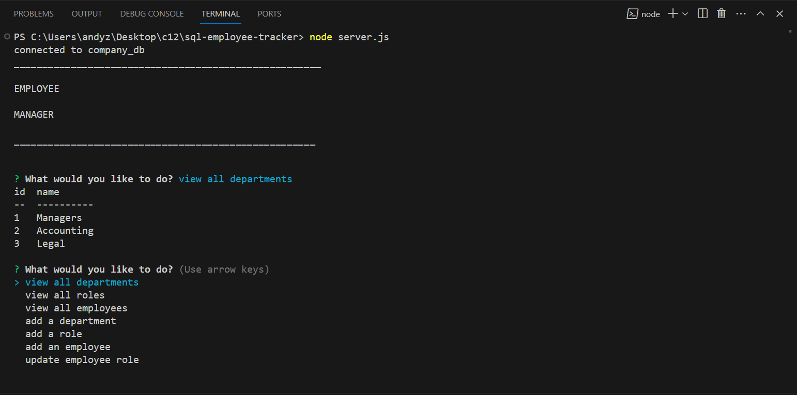

# sql-employee-tracker 

[Link to Walkthrough Video](https://watch.screencastify.com/v/6QiUleTCpNdZ3OPlpNIJ)

## Technology Used:
 * node - https://nodejs.org/en/about
 * npm - https://www.npmjs.com/
 * inquirer - https://www.npmjs.com/package/inquirer
 * console.table - https://www.npmjs.com/package/console.table
 * mysql2 - https://www.npmjs.com/package/mysql2

 ## Description
 
 This application is for a business owner who can veiw and manage the departments, roles, and employees, to plan and organize a business. 

 ## Table of Contents
  
   * [Installation](#installation)
   * [Usage](#usage)
   * [License](#license)
   * [Badges](#badges)
   * [Tests](#tests)
   * [Contributing](#contributing)
   * [Credits](#credits)

## Installation

This application requires inquire, mysql2, and console.table.  
* To install all dependences, run: npm install
* To start the program, run: node server.js

## Usage

when the application is started.  The user is prompted with questions: view all departments, view all roles, veiw all employees, add a department, add a role, add an employee, and update an employee role. This was accomplished using inquirer and mysql.  Below is a code snippet.

    inquirer
        .prompt ([
            {
                type: "list",
                message: "What would you like to do?",
                name: "selected",
                choices: [
                    "view all departments",
                    "view all roles",
                    "view all employees",
                    "add a department",
                    "add a role",
                    "add an employee",
                    "update employee role"
                ],
            },
        ])

SQL commands where used to create View all employees: 

    db.promise().query(`
                SELECT employee.id, employee.first_name, employee.last_name, department.name AS Department, role.title, role.salary, employee.manager_id AS Manager
                FROM employee
                LEFT JOIN role ON employee.role_id = role.id
                LEFT JOIN department ON role.department_id = department.id
                `
                ).then(([results]) => {
                    console.table(results)
                })

## License

 This project is licensed with MIT license

 Link to License - [Website to MIT License]((https://opensource.org/license/mit))

 ## Badges

 

 ## Tests
 
 This application does not have any tests

 ## Contributing

 Contact me if you interested in contributing:

 Check out my [github](https://github.com/AZurek17) page or send me a [email](mailto:andyzurek@gmail.com)

 ## Credits
 * Tutoring Session
 * ChatGPT
 * StudyGroup

 &copy;2023, Written by Andy Zurek
